# 项目配置

可在 `src/com/service/JdbcConfig` 中进行数据库账号配置，我在项目中设置数据库用户名为 `root`，数据库密码为 `123456`，可以自行对照修改。

另外数据库配置文件在 `src/resources/sql/` 下。


# 开发工具
工具 | 说明
---| ---
JDK 1.8 | Java环境
IDEA | 编译器
MySQL 8.0.36 | 数据库
Navicat 16 | 数据库图形化管理工具


<br/>

# 系统结构
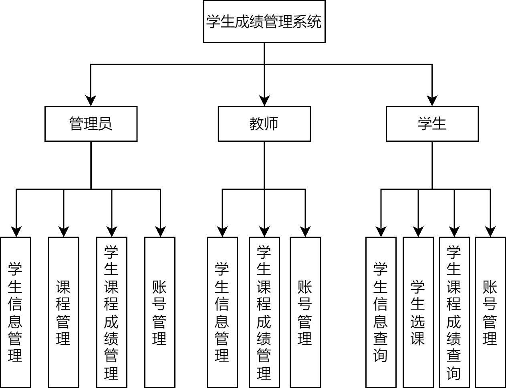

<br>


# 功能展示
## 登录与注册界面（通用）
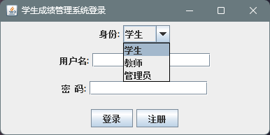


<br/>

## 主界面（通用）


> 学生、教师和管理员的主界面相同，菜单栏里功能不同。

<br/>

## 学生信息查询界面（学生用户）
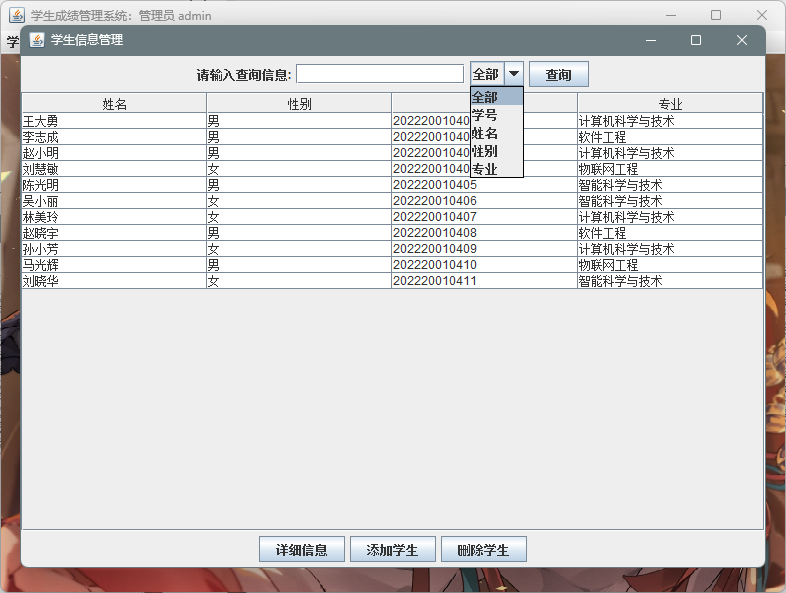

> 采用数据库模糊搜索，支持关键词搜索。

> 选中表格中的一行数据后点击底部按钮，可以查看详细信息。

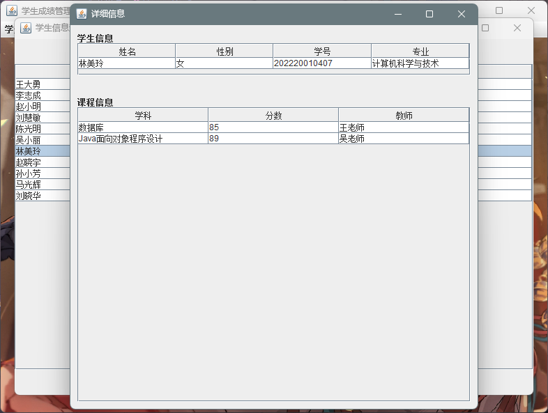

<br/>

## 学生信息管理界面（教师用户 管理员用户）

> 在学生查询的基础上，增加了添加和删除的功能。由于学生的学号与选课联系的学号形成外键约束，当这里删除某个学生，对应该学生的所有课程成绩及选课都会删除。

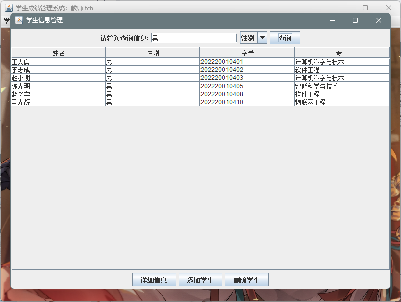
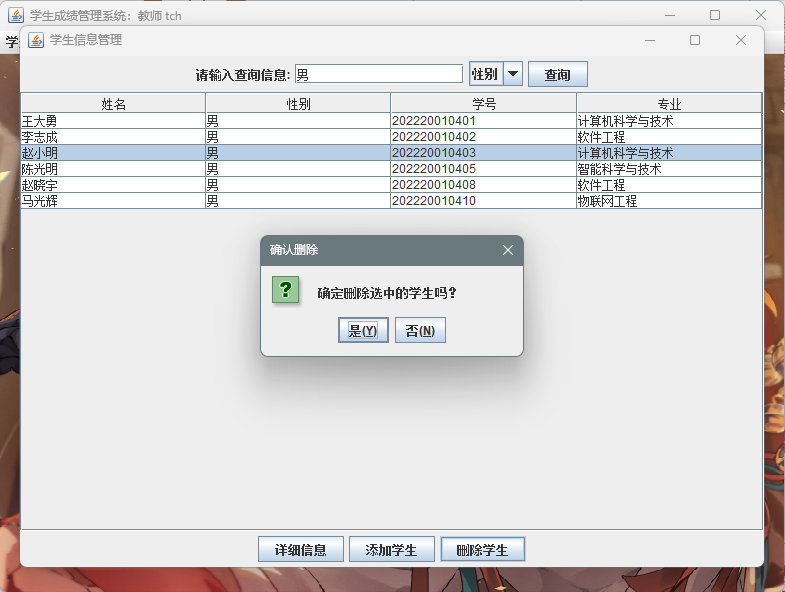
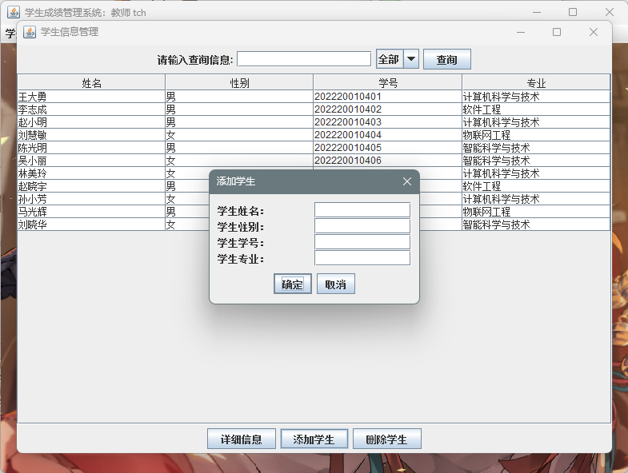

<br/>

## 学生选课界面（学生用户）
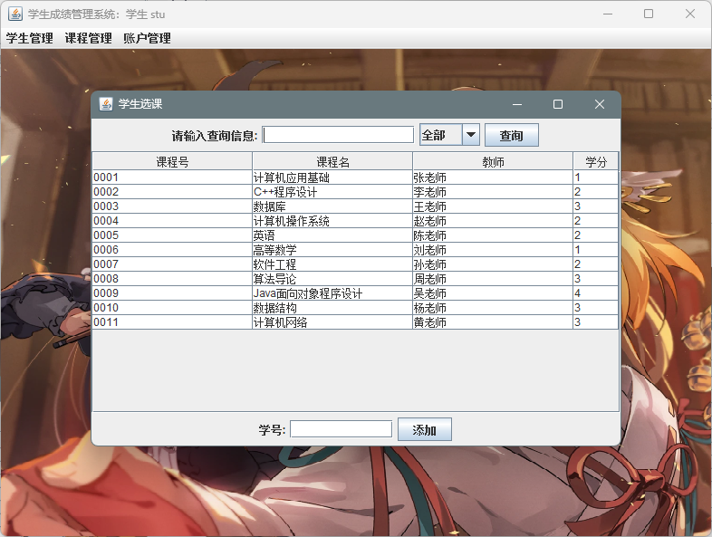
> 在表里选中对应课程行，再填入学号，点击添加按钮，即可添加课程，学生添加好的课程，显示是无分数的，需要教师或管理员进行成绩管理，就会有分数。


<br/>

## 学生课程成绩查询界面（学生用户）
> 学生刚选课完，课程成绩为空，需要教师或管理员进行成绩管理，就会有分数。

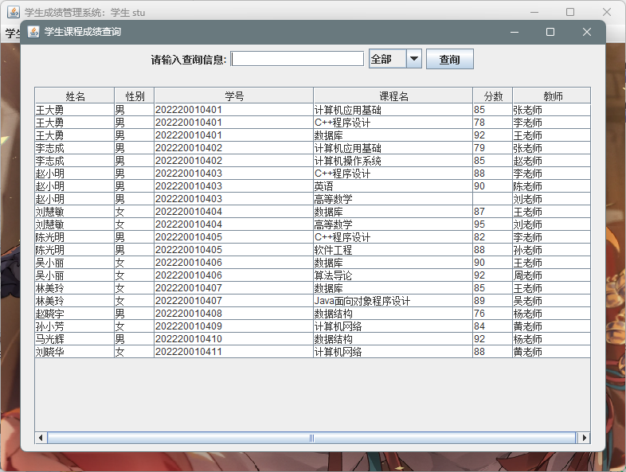

<br/>

## 学生课程成绩管理界面（教师用户 管理员用户）
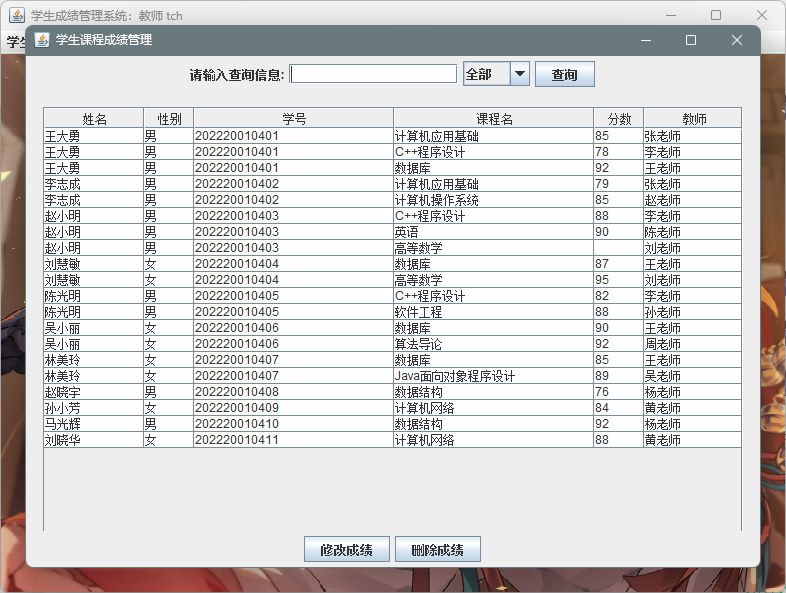
> 老规矩选中对应的一行的课程成绩，就能进行修改和删除。

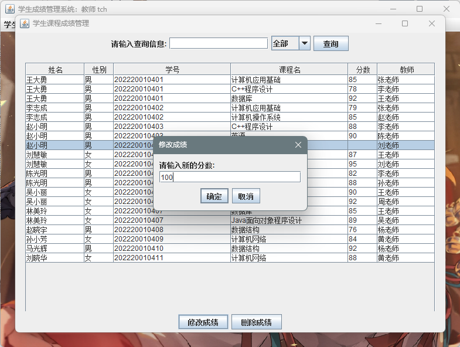
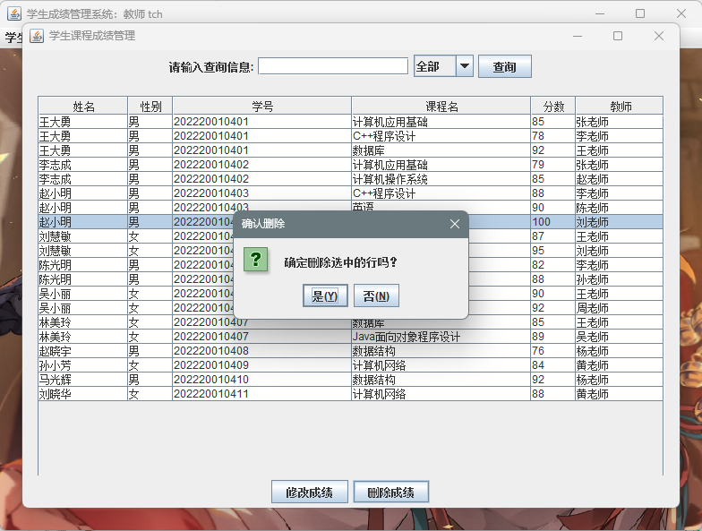

<br/>

## 学生课程管理界面（管理员用户）
> 可将学生的课程增加与删除。由于课程的课程号与选课联系的课程号形成外键约束，当这里删除某个课程，对应该课程的所有课程成绩及该选课都会删除。

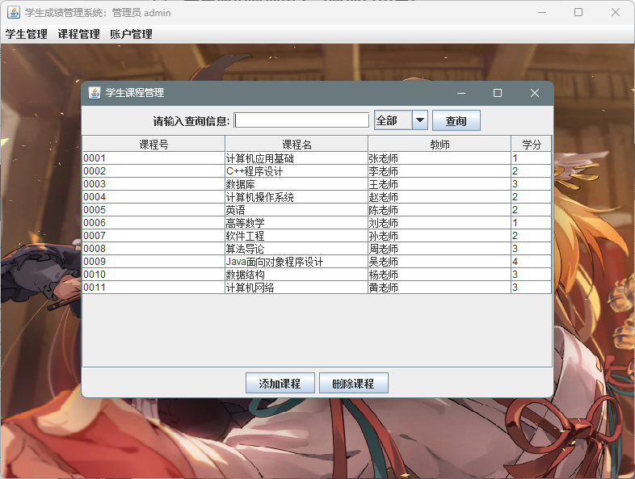

<br/>

## 修改密码界面（通用）


<br/>

# 数据库设置
## 数据库E-R图
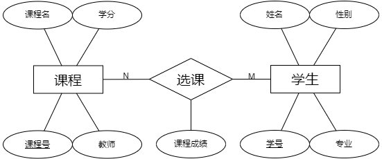

## 创建和管理数据库的SQL命令

```sql
-- 创建数据库并使用 utf8mb4 字符集和排序规则
CREATE DATABASE studata CHARACTER SET utf8mb4 COLLATE utf8mb4_unicode_ci;
USE studata;

-- 创建 user_stu 表
CREATE TABLE `user_stu` (
    `username` VARCHAR(30) PRIMARY KEY,
    `password` VARCHAR(30) NOT NULL
) ENGINE=INNODB DEFAULT CHARSET=utf8mb4 COLLATE=utf8mb4_unicode_ci;

-- 创建 user_tch 表
CREATE TABLE `user_tch` (
    `username` VARCHAR(30) PRIMARY KEY,
    `password` VARCHAR(30) NOT NULL
) ENGINE=INNODB DEFAULT CHARSET=utf8mb4 COLLATE=utf8mb4_unicode_ci;

-- 创建 user_admin 表
CREATE TABLE `user_admin` (
    `username` VARCHAR(30) PRIMARY KEY,
    `password` VARCHAR(30) NOT NULL
) ENGINE=INNODB DEFAULT CHARSET=utf8mb4 COLLATE=utf8mb4_unicode_ci;

-- 创建 stu 表
CREATE TABLE `stu` (
    `name` VARCHAR(20) NOT NULL,
    `gender` CHAR(2) NOT NULL,
    `sno` CHAR(12) NOT NULL UNIQUE PRIMARY KEY,
    `major` VARCHAR(12) DEFAULT NULL
) ENGINE=INNODB DEFAULT CHARSET=utf8mb4 COLLATE=utf8mb4_unicode_ci;

-- 创建 course 表
CREATE TABLE `course` (
    `cno` CHAR(4) NOT NULL,
    `cname` VARCHAR(20) DEFAULT NULL,
    `cteacher` VARCHAR(20) DEFAULT NULL,
    `credit` INT(11) DEFAULT NULL,
    PRIMARY KEY (`cno`) USING BTREE
) ENGINE=INNODB DEFAULT CHARSET=utf8mb4 COLLATE=utf8mb4_unicode_ci;

-- 创建 sc 表
CREATE TABLE `sc` (
    `sno` CHAR(12) NOT NULL,
    `cno` CHAR(4) NOT NULL,
    `score` INT(11) DEFAULT NULL,
    PRIMARY KEY (`sno`, `cno`),
    CONSTRAINT `fk_sc_cno` FOREIGN KEY (`cno`) REFERENCES `course` (`cno`) ON DELETE CASCADE,
    CONSTRAINT `fk_sc_sno` FOREIGN KEY (`sno`) REFERENCES `stu` (`sno`) ON DELETE CASCADE
) ENGINE=INNODB DEFAULT CHARSET=utf8mb4 COLLATE=utf8mb4_unicode_ci;

-- 插入 user_admin 表数据
INSERT INTO `user_admin` (`username`, `password`) VALUES ('admin', '123');
-- 插入 user_tch 表数据
INSERT INTO `user_tch` (`username`, `password`) VALUES ('tch', '123');
-- 插入 user_stu 表数据
INSERT INTO `user_stu` (`username`, `password`) VALUES ('stu', '123');

-- 插入 course 表数据
INSERT INTO `course` (`cno`, `cname`, `cteacher`, `credit`) VALUES
('0001', '计算机应用基础', '张老师', 1),
('0002', 'C++程序设计', '李老师', 2),
('0003', '数据库', '王老师', 3),
('0004', '计算机操作系统', '赵老师', 2),
('0005', '英语', '陈老师', 2),
('0006', '高等数学', '刘老师', 1),
('0007', '软件工程', '孙老师', 2),
('0008', '算法导论', '周老师', 3),
('0009', 'Java面向对象程序设计', '吴老师', 4);

-- 插入 stu 表数据
INSERT INTO `stu` (`name`, `gender`, `sno`, `major`) VALUES
('王大勇', '男', '202220010401', '计算机科学与技术'),
('李志成', '男', '202220010402', '软件工程'),
('赵小明', '男', '202220010403', '计算机科学与技术'),
('刘慧敏', '女', '202220010404', '物联网工程'),
('陈光明', '男', '202220010405', '智能科学与技术'),
('吴小丽', '女', '202220010406', '智能科学与技术'),
('林美玲', '女', '202220010407', '计算机科学与技术');

-- 插入 sc 表数据
INSERT INTO `sc` (`sno`, `cno`, `score`) VALUES
('202220010401', '0001', 85),
('202220010401', '0002', 78),
('202220010401', '0003', 92),
('202220010402', '0001', 79),
('202220010402', '0004', 85),
('202220010403', '0002', 88),
('202220010403', '0005', 90),
('202220010404', '0003', 87),
('202220010404', '0006', 95),
('202220010405', '0002', 82),
('202220010405', '0007', 88),
('202220010406', '0003', 90),
('202220010406', '0008', 92),
('202220010407', '0003', 85),
('202220010407', '0009', 89);
```
